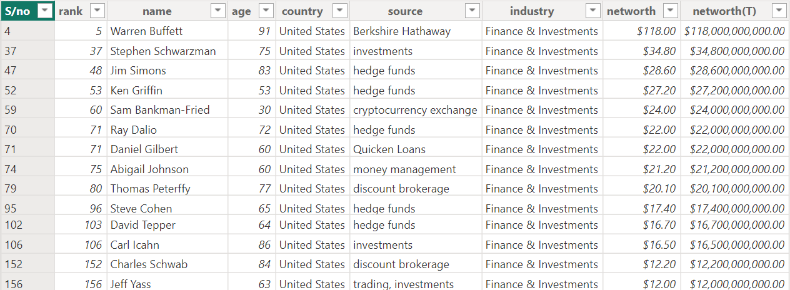
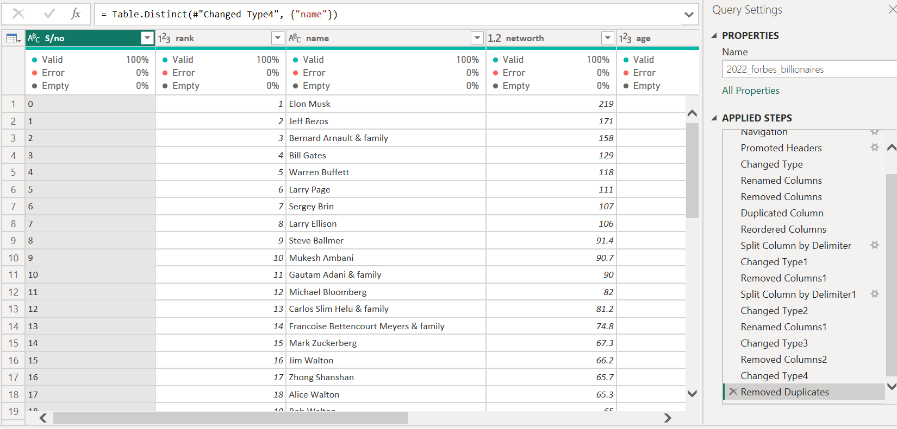
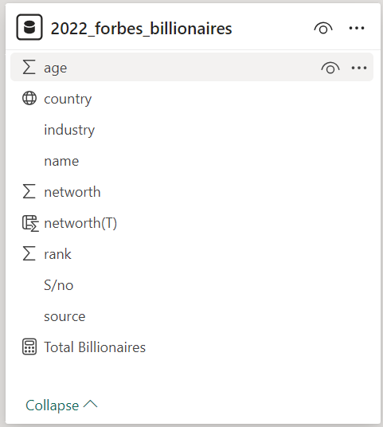
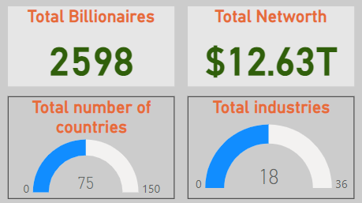
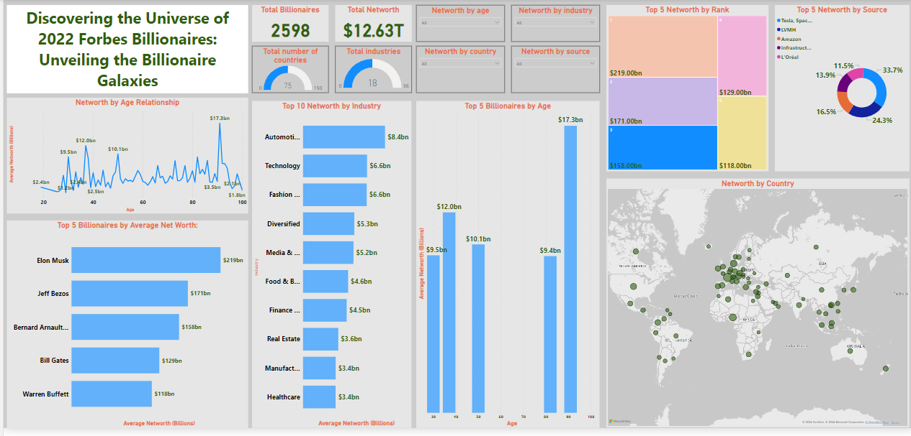
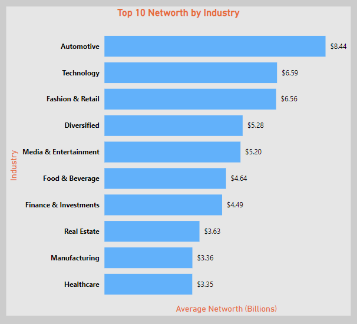
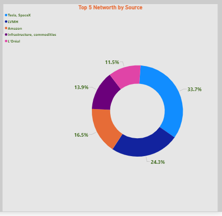
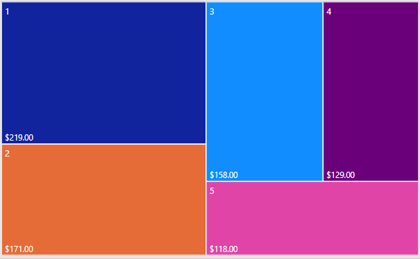
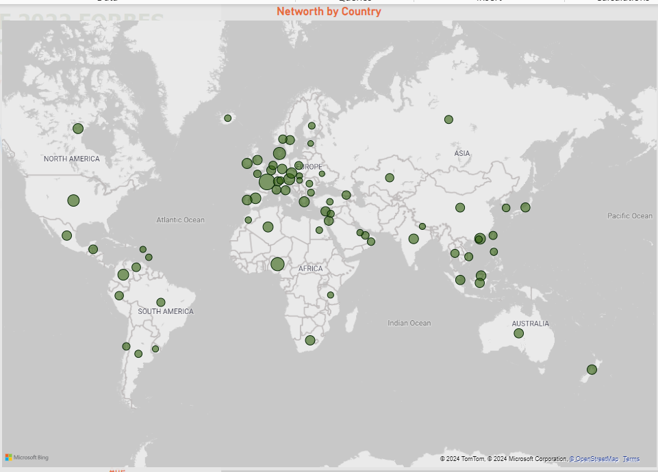

# Discovering-the-Universe-of-2022-Forbes-Billionaires
Explore the Forbes Billionaires Universe 2022 to uncover insights into wealth creation. Analyze the world's richest individuals' age, industry, and location trends. Embrace data-driven decision-making and collaboration for sustainable success in the business landscape

## Introduction:
This is a Power BI Project on analysis of **2022 Forbes Billionaires List** unveiling the billionaires Galaxies to get to know their sources of income, the countries with top billionaires.
We will be going through the Forbes Billionaires Universe for 2022, delving into the fascinating world of the world's richest individuals. This in-depth examination of the exclusive Forbes Billionaires List thoroughly examines the 2,598 billionaires who epitomize affluent achievement.
This journey navigates through their dynamic world, revealing the intriguing patterns among these super-rich stars. Discover the startling connections and interplay on how age, industry, and location interact to trace the genesis of these enormous riches. Find out what drives the enormous riches of these people, from computer titans to real estate tycoons. This presentation invites you to uncover hidden insights and surprising connections within the billionaire galaxy.

**_Data Source_**:
 - _Data sourced from the prestigious Forbes Billionaires List of 2022,_
 - _The dataset comprises about 2,598 billionaires worldwide in 2022,_
 - _The key attributes include rank, name, net worth, age, country, source, and industry._

## Skills/Concepts Demonstrated 
The following Power Bi concepts were incorporated
- Bookmarking, 
- DAX,
- Quick Measures, 
- Page Navigation, 
- Modeling, 
- Filters.

## Key Questions to Explore
1.  Who are the wealthiest individuals on the planet?
2.  What industries and countries dominate the billionaire landscape?
3.  How does age influence net worth accumulation?
4.  What are the primary sources fuelling the billionaire fortunes?

## Table View and Power Query:

Table View:                    |          Power Query:
:-----------------------------:|:---------------------------:
             | 

## Modeling:
The Data table with a single Normalized data Table in a CSV file Loaded into Power BI to Give the following Model View

- Data imported into Power BI for analysis
- Handled data inconsistencies with power query
- Standardized formatting and data types with power query

## Visualization:
-The following shows the metrics for the 2022 Forbes Billionaires

 

The total number of billionaires for 2022 is 2598, with a total worth of Twelve Trillion Six Hundred and Forty Billion Dollars only ($12.64 Trillion), Across 75 Countries and a total of 18 Industry Sectors

# Data Analysis – findings and insights:

## Top Billionaires:

### By Different Categories of Networth
The Top 5 Billionaires by Names had Elon Musk as number 1, followed by Jeff Bezos, Bernard Arnault, Bill Gates, and Warren Buffet respectively, While with the Top 10 industries were Automobile, Technology, Fashion, Diversified, Media, Food & Beverages, Finance, Real estate, Manufacturing and Healthcare respectively

Top 5 Billionaires By Networth:                        |         Top 10 Networth By Industry:
:-----------------------------------------------------:|:---------------------------:
              | 

The Top 5 Billionaires by Rank had $219 Billion ranking as number 1, followed by $171, $158, $129, and $118 Billion Dollars respectively with the Top five net worth coming from Tesla, Space X, LVMH, Amazon, Infrastructure, and L'Oréal Respectively

Top 5 Billionaires By Source:                          |         Top 5 Networth By Rank:
:-----------------------------------------------------:|:---------------------------:
                               | 

### Geographic Distribution of Billionaires:

The Distribution of billionaires by countries and continent has Europe with the highest number of billionaires followed by Asia, South America, North America, Africa and the Pacific Respectively.

# Recommendations:
Based on the analysis presented on the 2022 Forbes Billionaires dataset, the following recommendations are made:

- Leverage industry insights to identify drivers of wealth accumulation and potential investment opportunities.
- Explore geographic hotspots to understand conducive economic, political, and cultural factors for fostering wealth creation.
- Analyze age trends to gain lessons on wealth-building strategies across different life stages.
- Investigate sources of wealth to uncover key factors driving wealth creation and inform investment and business strategies.
- Embrace data-driven decision-making by investing in robust data analytics capabilities and fostering a data-driven culture.
- Foster collaboration and knowledge sharing among stakeholders, policymakers, and industry leaders to stimulate innovation and 
  promote sustainable economic growth.
- By implementing these recommendations, organizations, and individuals can gain a competitive edge, make well-informed decisions, 
  and position themselves for sustainable success(wealth creation, strategic decision-making, and sustainable growth)  in the  
  ever-evolving business landscape.

## Conclusion:
The Forbes Billionaires dataset of 2022 offers a captivating glimpse into the realm of extreme wealth of individuals.
This analysis serves as a launchpad for further exploration and strategic decision-making where necessary.
Embrace the power of the available data used to navigate the ever-evolving billionaire cosmos in the year 2022.
By presenting the above analysis in this engaging and visually compelling guide, a comprehensive understanding of the billionaire landscape, as revealed by the 2022 Forbes Billionaires has been unveiled.

